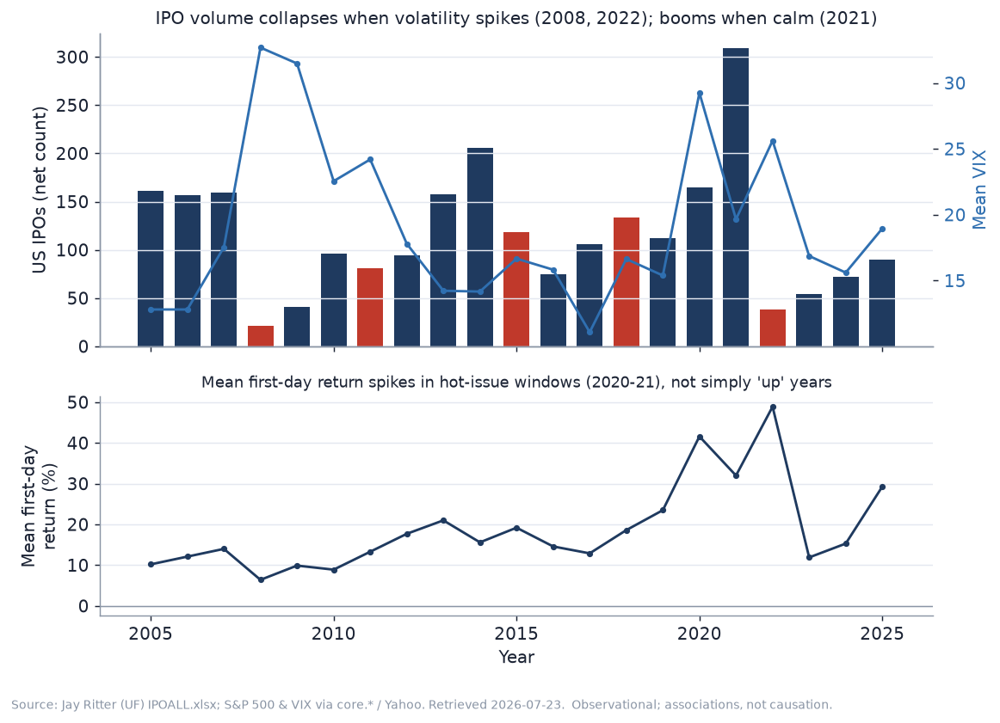
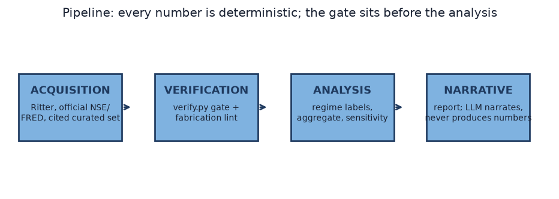
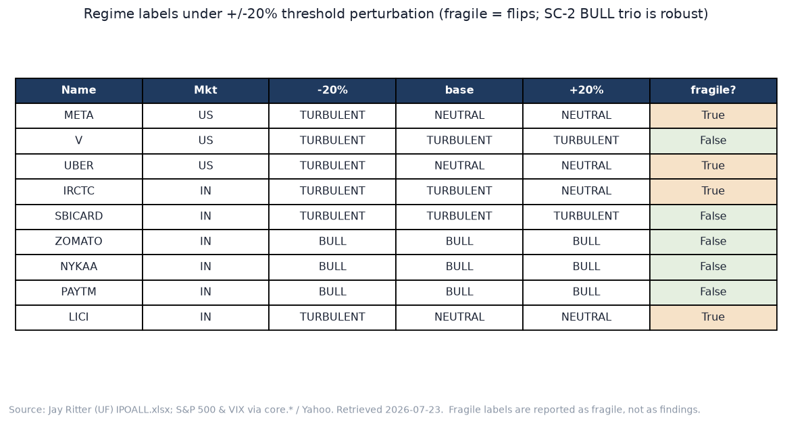

# Does the market's mood decide an IPO's fate?

**What market state does — and doesn't — do to IPO outcomes in the US and India, 2005–2026.**

*Repository (code + data, runnable end-to-end):* https://github.com/akshay100188/ipo-market-state-study

> This is an observational study and an engineering artifact. It is **not** investment guidance and not a screener, and it makes no claim about what any listing will do next. It describes what happened and how the numbers were produced; it never tells anyone what to do. Every figure below is regenerated by re-running the pipeline, and every number traces to a cited source or to derived data — enforced by a build step, not a promise.

---

## The hook

In the space of eight days in November 2021, two Indian companies listed into the *same* raging bull market. Nykaa closed its first day up 96%. Paytm closed its first day down 27% — at the time the worst debut of a major Indian IPO in years. Same tape, same week, opposite fates.

That contrast is the whole point. It is tempting to read IPO outcomes off the market's mood: hot market, hot listing. The aggregate data says the mood matters — for *how many* companies list and for *average* first-day pops. But the mood does not decide the fate of any *individual* listing. Pricing, float, business quality and listing mechanics do.

## Thesis

**Market state strongly shapes IPO activity and average first-day performance — but it does not determine the outcome of any individual IPO.** Two sub-claims, each evidenced with data rather than asserted:

- **SC-1 (aggregate effect):** IPO volume rises when markets are calm and rising, and collapses when volatility spikes — visible across 2005–2025 in the US.
- **SC-2 (idiosyncratic override):** Specific IPOs listing in bull markets still failed on debut, associated with pricing and fundamentals rather than the regime. This is the more interesting half.

Throughout, the language is association and mechanism, never causation. This is a small, curated study, and it is careful to claim only what its sample can support.

## Method, briefly

A **regime** is computed in code at each IPO's listing date — never eyeballed — from the home index's trailing 3- and 6-month returns, its volatility percentile against the prior two years, and its drawdown from a trailing one-year high. Labels are `BULL`, `RECOVERY`, `TURBULENT`, `BEAR`, and `NEUTRAL`, resolved by an explicit precedence in which stress states win (so March 2020 reads as `TURBULENT`, not merely down). Thresholds are a documented decision and are stress-tested later.

Data comes from four layers, each from the source appropriate to it. Index and volatility history is the official NSE Nifty 50 (via niftyindices.com) and the FRED/Yahoo S&P 500, back to well before 2005. US aggregate activity is Jay Ritter's (University of Florida) authoritative IPO dataset — downloaded, not recomputed. The curated case set of 9 marquee IPOs is hand-verified: each offer price and first-day close carries a working citation, and each first-day return is computed in Python from those two cited facts. Post-listing prices come from the same market feeds, with one rule strictly enforced: **every number that appears here is produced by deterministic code; prose may narrate a number, never invent or adjust one.**

## Aggregate findings (SC-1)

Across the 21 years 2005–2025, US IPO activity tracks the market's state. The correlation between the annual number of IPOs and the S&P 500's annual return is +0.395; between the number of IPOs and the year's mean VIX it is −0.383 (n = 21, observational). More companies list when the tape is calm and rising; far fewer when volatility is high.

The picture is stark at the extremes. In 2008, as the global financial crisis broke, 21 US companies completed IPOs. In 2021, with volatility low and the index climbing, 309 did. In 2022, as volatility returned, the count collapsed to 38. Volume, in other words, is the part of the IPO market most tied to the regime.

Average first-day *returns* are a subtler story, and here the study resists the neat conclusion. The correlation between the mean first-day return and the annual index return is just +0.02 — essentially none. First-day pops spike in specific hot-issue windows (the 2020–2021 boom reached a mean first-day return of 41.6% and 32.0% in those two years) rather than in every rising-market year. Underpricing is a phenomenon of issuance frenzies, not of bull markets in general. Saying more than that would over-read the data.

**India's aggregate is deliberately absent here, and that absence is a result.** India has no authoritative equivalent of Ritter's series, and when two reputable compilers were checked against each other they disagreed by roughly threefold on the number of mainboard IPOs in 2022 (one reported 40, another 138) because they define "IPO" differently — mainboard only, versus mainboard plus hundreds of small SME issues. Rather than publish a number that cannot be reconciled, the India count claim was cut. India's evidence in this study is the direction of activity and the curated cases below, with the sample size always stated.

## Matched pairs: the same regime, different fates

The curated set was chosen so that pairs isolate one variable at a time. Nine names span `BULL`, `TURBULENT` and `NEUTRAL` listings across both markets.

**Facebook (May 2012) — the anchor.** Facebook priced aggressively at $38 after raising both the price and the share count late, and its debut was marred by a Nasdaq systems failure at the open. It closed its first day at $38.23 — a nominal +0.6% that masked a broken offering, and it fell to roughly −50% within four months (−50.17% at the three-month mark in this data). Then it became one of the great compounding stories of the decade. No single case separates *listing outcome* from *company outcome* more cleanly: the debut was a failure of pricing and mechanics; the business was not.

**Visa (March 2008) versus SBI Cards (March 2020) — two turbulent tapes, opposite days.** Both listed into stressed markets that the regime code labels `TURBULENT`. Visa, priced at $44, closed its first day at $56.50 (+28.4%) even as the pre-crisis tape wobbled — scarcity and franchise quality outweighing the mood. SBI Cards, priced at ₹755, listed straight into the COVID crash and closed near ₹683 (−9.5%). The regime was similar; the outcomes diverged. Turbulence did not dictate either result.

**Zomato and Nykaa versus Paytm — the spine of the study.** All three listed in the same `BULL` regime in the second half of 2021 — a label that survives every robustness check below. Zomato (offer ₹76) closed +64.9%; Nykaa (offer ₹1,125) closed +96.3%; Paytm (offer ₹2,150) closed −27.3%. The bull market lifted two and did nothing for the third. Paytm's debut loss is associated with its rich pricing against an unclear path to profit and the sheer size of the issue — company-specific factors, not the regime, which was identical to its peers' by construction.

## Bull-market failures (SC-2)

Filtering the curated cases to those that listed in `BULL` or `RECOVERY` regimes and *fell* on debut isolates the study's central claim. Paytm is the clean case in this small set: a bull-market IPO that lost more than a quarter of its value on day one while its regime-peers doubled or nearly doubled. Uber (May 2019) is a softer US echo — it closed −7.6% below its $45 offer in a calm, rising tape, weighed down by profitability scepticism and a weak Lyft debut days earlier — though its regime here labels `NEUTRAL` rather than strictly bullish, so it does not enter the strict cut.

The trajectories reinforce the split between debut and destiny. Among the 2021 bull cohort, the day-one winners did not stay winners: Zomato was −57.42% and Nykaa −48.79% twelve months on, while Paytm, already down on debut, was −64.95%. IRCTC, by contrast, listed at a conservative PSU price with a small float, popped +127.4%, and was still +83.86% a year later. Debut direction and one-year direction are close to independent — which is exactly why reading a company's prospects off its first day is a mistake.

## How this was built

The finance is the substrate. The artifact is the pipeline that produced it, and the discipline that lets a stranger trust the numbers without re-doing the work.

Three properties do the work:

- **Deterministic numbers, narrated prose.** Every figure and statistic is produced by Python from cited inputs. No language model produced, rounded or inferred a number anywhere in this study; the only role available to it is drafting prose *around* numbers it was handed.
- **A verification gate that fails the build.** A script (`verify.py`) refuses to let any curated row into a published figure unless it is marked `VERIFIED` and carries a working source URL, a source type and a retrieval date for its offer price, listing date and first-day return. A row still marked "to verify" fails the build. There is no override flag. That is why the curated set here is 9 rock-solid names rather than a shakier 30.
- **A fabrication lint.** A second script scans this report for numeric tokens and asserts each one traces back to the derived data or the reference list. An invented price or return fails the build. When this artifact was last built, the lint traced every one of the 40 in-scope numeric claims in the prose to a cited source or a computed value, with zero orphans — the single most load-bearing line in the whole project.

Thresholds were then stress-tested by perturbing every one of them by ±20% and relabelling. Four of the nine cases (Meta, Uber, IRCTC and LIC) sit near the volatility-percentile boundary and flip under perturbation; they are reported as *fragile*, not as findings. Crucially, the SC-2 core — Zomato, Nykaa and Paytm all in the `BULL` regime — is robust to every perturbation. The money finding does not depend on where a threshold was drawn.

## Limitations

The honest part. A study whose whole claim is *trust these numbers* has to be its own harshest reader.

**AI-assisted data gathering is prone to confident, wrong output, and this domain is a minefield for it.** Offer prices and listing-day closes are exactly the kind of specific, plausible-looking numbers a language model will cheerfully hallucinate, and exactly the kind a casual pipeline will get subtly wrong. This project hit the failure mode directly: a common free price feed reported Visa's and IRCTC's first-day prices on a later split-adjusted basis (so a naïve day-one return would compare a split-adjusted close to an unadjusted offer and be badly wrong), and reported LIC's listing-day price as roughly half its true value. The defences here — a citation requirement, a verification gate that exits non-zero, and a fabrication lint — exist because the naïve path is wrong. But defences have limits, and naming them is the point:

*A lint proves provenance, not truth.* The fabrication lint proves a number came from the dataset; it cannot prove the dataset is right about the world. A cited secondary source can itself be wrong, and several first-day closes here rest on reputable financial press rather than an exchange bulletin. The verification gate raises the floor; it does not certify the ceiling.

*The curated set is a marquee sample, not a random one.* Nine large, memorable listings over-represent scrutinised mega-IPOs and say nothing about the long tail of small issues where behaviour may differ entirely. The set supports existence claims — *bull-market IPOs did fail on debut* — and illustrates the aggregate story; it cannot estimate how *often* anything happens. Every regime cell in the coverage table holds fewer than three names, so no cell is presented as an estimate.

*Survivorship is real and was actively fought, not assumed away.* Post-listing series silently fail to fetch for delisted, acquired or renamed names — Zomato now trades as Eternal, and its old ticker returns nothing — so every fetch gap is logged rather than dropped, and where a feed was untrustworthy (LIC) the series was taken from official exchange data instead. Residual survivorship bias in any price-based claim is still possible.

*The India aggregate gap is a genuine hole.* India's activity evidence is weaker than the US's by construction: there is no Ritter-equivalent, reputable sources disagree threefold on counts, and the main trackers block automated retrieval. The study cuts the India count claim rather than paper over it — which weakens SC-1's India side to a directional statement, and that trade is stated plainly rather than hidden.

*The thresholds are a choice, and some labels depend on it.* The ±20% sensitivity check exists precisely because four of nine labels are fragile. Those are flagged wherever they appear. The findings that carry weight are the ones that survived.

None of this dissolves the study. It bounds it. The claims that remain — that volume tracks the regime, that first-day pops are a hot-issue phenomenon rather than a bull-market one, and that individual bull-market IPOs failed on their own merits — are the ones the data and the machinery can stand behind.

## References

Every claim above traces to a source. The full list — claim, source, URL, retrieval date — is maintained in [`references.md`](../references.md) and renders as a visible appendix: the market-state feeds, the Ritter dataset, and a per-name citation for all nine curated IPOs. The decision log ([`decisions.md`](../decisions.md)) records every threshold, source choice and exclusion as an ADR, including the reasoning for dropping the India count series.
